# 爵士乐演奏基础——布鲁斯音乐
## 第一章：早期布鲁斯音乐
### 乡村布鲁斯

- Delta Blues发源于美国密西西比三角洲，最早期的布鲁斯
- 代表人物：

    Son House主打律动grove多用layback，与Charlie Patton、Willie Brown被称为早起三角洲布鲁斯最重要的人物，发明了吉他演奏中“滑棒slide”的演奏方式。

    John Lee Hooker《Boom Boom》

    Robert Johnson几个月内提升了吉他技巧，周围的人不相信就传他在十字路口遇到了恶魔，出卖了自己的灵魂换取了高超的演奏技巧——《Cross Road Blues》

- 这个时期的布鲁斯有很大的即兴成分（歌词和旋律）
- 口琴演奏技巧：压音bend note
- 口琴之王Sonny Boy Williamson《Bye Bye Bird》多用压音和颤音；《Down and Out》，Junior Wells
- Shuffle律动：记谱时记两个评价的八分音符，实际上是三连音挖去中间一个音，演奏时心中默念1、2、3
- Debo Ray 《Down Herated Blues》by Bessie Smith

### 城市布鲁斯
- 钢琴手、歌手、节奏组、管乐 blues & swing jazz摇摆爵士乐
- 乐器发生了变化：指弹木吉他->拨片演奏电吉他（更细的琴弦）推弦、揉弦、效果器（失真、过载）
- 萨克斯（模仿人声），例如小号演奏家Louis Armstrong爵士音乐之王在Bessie Smith《Careless Love Blues》中小号的颤音就是模仿歌手的唱法

    一些萨克斯演奏技巧：滑音、颤音、喉音
- 盲人音乐家Roland Kirk可以同时一人演奏多种木管乐器，12/8拍Shuffle blues摇摆布鲁斯《Blue Rol》
- 歌唱家Ma Rainy“布鲁斯之母”（是Bessie Smith的老师），传记电影《蓝调女王》
- 乡村布鲁斯以男歌手为主，用假声和呐喊来表达哀怨和愤怒的情绪，节奏也很自由，曲式不固定，所以风格粗犷而夸张；而城市布鲁斯以女歌手为主，忧伤而细腻，歌词也添加了很多爱情的元素，演唱中滑音glissando和颤音vibrato技巧很常见。
  由于小调布鲁斯有降三、五、七音，所以有滑音有小调特点，滑音也分上行和下行。同时训练滑音和颤音：

- 一个非常明显的音乐特点——呼应：通常由歌手演唱一段旋律带有提问的语气，紧接着，萨克斯会演奏相似的旋律去配合歌手，或者补充音乐里的空白。
- 《St. Louis Blues》

## 第二章：基础乐理知识和一种重要的节奏
### 六种常见的和弦与和弦标记basic chord theories

- 和弦：

    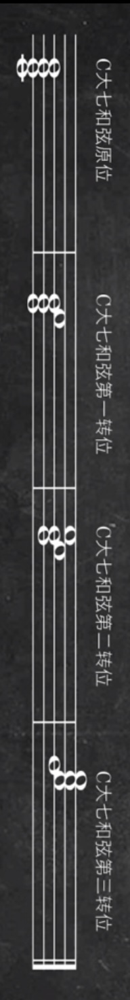
    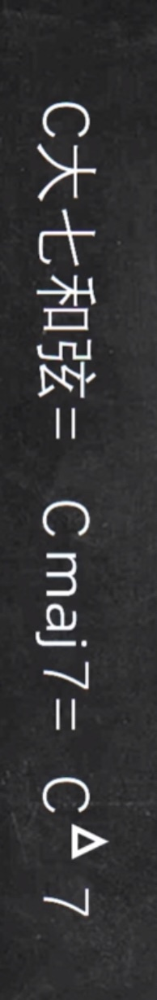
    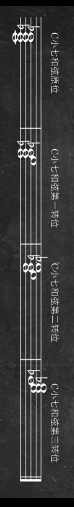
    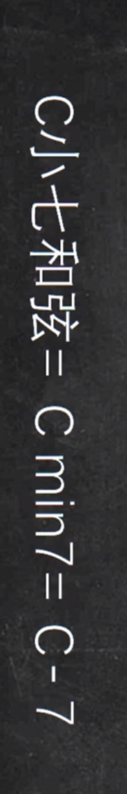
    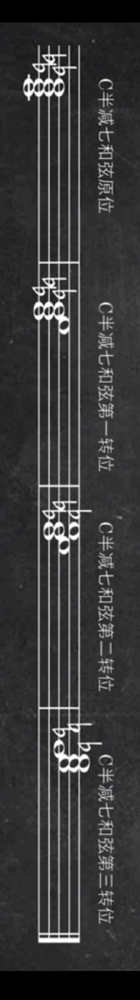
    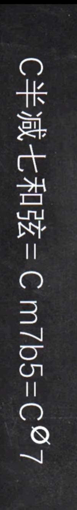
    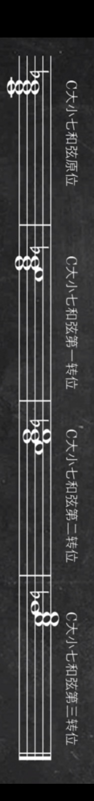
    
    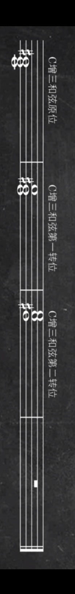
    
    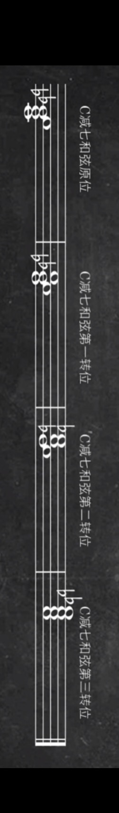
    
    C maj 7表示C major 7，min表示minor，aug表示augment增加，dim表示diminished
    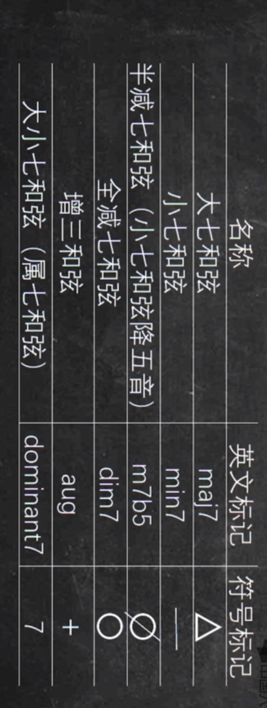

    找到每个和弦的12个调，减七和弦的原位实际上就是降E减七和弦和C减七和弦的转位（晕），只需要找到三个减七和弦
    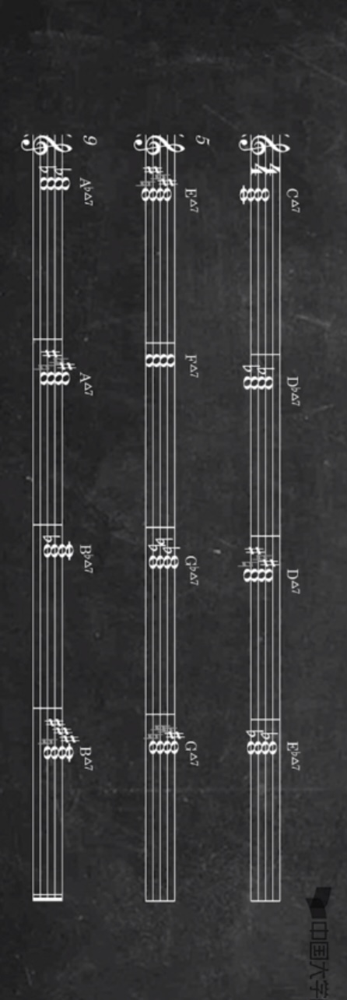

- 音阶：C大调布鲁斯音阶major blues scales（特征音：降三音），还需要找到C调、F调、降B调、降E调、G调的音阶
    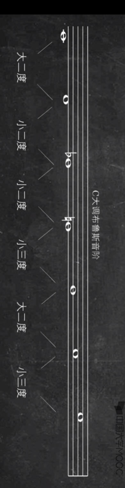
    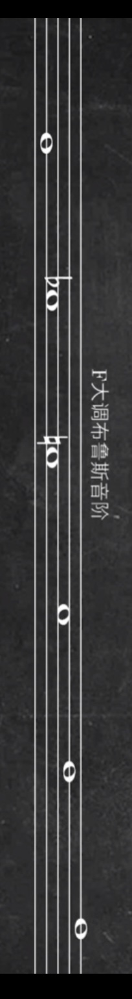
    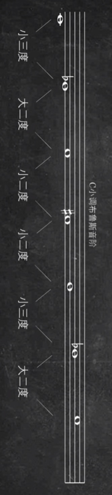
    C小调布鲁斯音阶minor blues scales，有小三和弦的特征
- 两种常用12小节布鲁斯和弦进行；在2,4拍使用节拍器

    传统的标准的布鲁斯结构：
    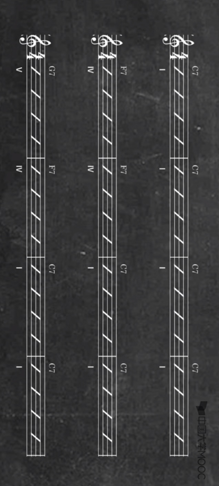
### 布鲁斯shuffle
首先思考把每个小节分成三连音或12/8拍，同时强调2/4拍