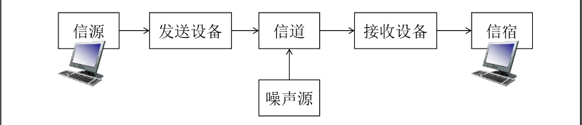
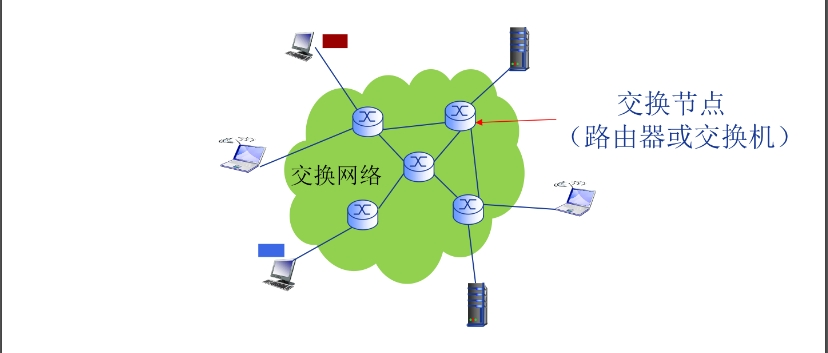

# 计算机网络
## 计算机网络概述
### 1.1 计算机网络基本概念
1. 计算机网络=通信技术+计算机技术
2. 通信系统模型：
    
    所以计算机网络就是一种通信网络，信源和信宿都是计算机
3. 定义：计算机网络就是互连（互联互通，通过通信链路）的、自治（计算机无主从关系）的计算机结合。
4. 如果距离远、数量大，就通过**交换网络**互连主机
    
5. Internet是全球最大的互联网络：ISP（Internet Service Provider）网络互连的“网络之网络”，将全球ISP与移动网络和区域ISP互连，区域ISP又与家庭网络、机构网络（如校园网等）互连。
    - 数以百万计的互连的计算设备集合：主机（hosts）=端系统（end systems），都会运行网络应用
    - 通信链路：光纤、铜缆、无线电、卫星……
    - 分组交换：转发分组（数据包）有路由器（routers）和交换机（switches）
    - Internet是网络应用提供通信服务的通信基础设施，实际上是为网络应用提供应用编程接口（API）：支持应用程序“连接”Internet，发送、接受数据（数据传输）
6. 硬件（主机、路由器、通信链路等）是计算机网络的基础，计算机网络中的数据交换必须遵守事先约定好的规则：网络协议。
7. 网络协议（network protocol）是为进行网络中的数据交换而建立的规则、标准或约定，规定了通信实体之间所交换的信息的格式、意义、顺序以及针对收到信息或发生的事件所采取的“动作”（actions）。
8. 协议三要素：
    - 语法Syntax：数据与控制信息的结构或格式（如果是底层信息，那就是信号电平）
    - 语义Semantics：需要发出何种控制信息、完成何种动作以及作出何种响应、差错控制
    - 时序Timing：事件顺序、（交换信息的）速度匹配
9. 协议是网络创新的表现之一（？）
10. Internet协议标准：RFC（Request for Comments），由IETF互联网工程任务组（Internet Engineering Task Force）进行管理。若要了解某些协议最权威的内容，看RFC文档。

### 1.2 计算机网络结构
