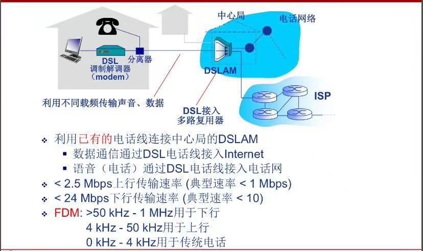

# 计算机网络
## 计算机网络概述
### 1.1 计算机网络基本概念
1. 计算机网络=通信技术+计算机技术
2. 通信系统模型：
    
    所以计算机网络就是一种通信网络，信源和信宿都是计算机
3. 定义：计算机网络就是互连（互联互通，通过通信链路）的、自治（计算机无主从关系）的计算机结合。
4. 如果距离远、数量大，就通过**交换网络**互连主机
    
5. Internet是全球最大的互联网络：ISP（Internet Service Provider）网络互连的“网络之网络”，将全球ISP与移动网络和区域ISP互连，区域ISP又与家庭网络、机构网络（如校园网等）互连。
    - 利用对等链路peering link将大的区域ISP互连/引入第三方IXP（Internet exchange point）互连
    - 可能出现区域网络regional networks连接接入ISP和运营商ISP
    - 内容提供商网络content provider networks（如Google，Microsoft）可能运行自己的网络，并就近为端用户提供服务、内容
    - Internet是动态性的（随时都有主机接入、断开），但我们可以刻画它的大致结构：
        
    - 数以百万计的互连的计算设备集合：主机（hosts）=端系统（end systems），都会运行网络应用
    - 通信链路：光纤、铜缆、无线电、卫星……
    - 分组交换：转发分组（数据包）有路由器（routers）和交换机（switches）
    - Internet是网络应用提供通信服务的通信基础设施，实际上是为网络应用提供应用编程接口（API）：支持应用程序“连接”Internet，发送、接受数据（数据传输）
6. 硬件（主机、路由器、通信链路等）是计算机网络的基础，计算机网络中的数据交换必须遵守事先约定好的规则：网络协议。
7. 网络协议（network protocol）是为进行网络中的数据交换而建立的规则、标准或约定，规定了通信实体之间所交换的信息的格式、意义、顺序以及针对收到信息或发生的事件所采取的“动作”（actions）。
8. 协议三要素：
    - 语法Syntax：数据与控制信息的结构或格式（如果是底层信息，那就是信号电平）
    - 语义Semantics：需要发出何种控制信息、完成何种动作以及作出何种响应、差错控制
    - 时序Timing：事件顺序、（交换信息的）速度匹配
9. 协议是网络创新的表现之一（？）
10. Internet协议标准：RFC（Request for Comments），由IETF互联网工程任务组（Internet Engineering Task Force）进行管理。若要了解某些协议最权威的内容，看RFC文档。

### 1.2 计算机网络结构

1. 组成部分：
    - 网络边缘：主机（运行网络应用）
    - 接入网络，物理介质：有线/无线通信链路（住宅、家庭接入网络、机构接入网络、移动接入网络）
    - 网络核心（核心网络）：互联的路由器（或分组转发设备）、网络的网络
2. 客户/服务器（client/server）应用模型：客户发送请求，接受服务器响应
3. 对等（peer—peer,P2P）应用模型：无（或不仅依赖）专用服务器（通信过程/通信交换过程），通信在对等的实体之间直接进行通信
4. 用户关心的是贷款bandwidth(bps)每秒传输数据的速率、接入方式共享/独占？
5. 数字用户线路（DSL，非对称数字用户线路ADSL）：多路信号共同使用一个物理介质来传输信号（电话线）
    
6. 电缆网络：
    
    
7. 无线接入网络：通过共享的无线接入网络连接端系统和路由器，通过“基站/接入点”。
    - 无线局域网（LANs）同一建筑物内（30m），WiFi：11Mbps，54Mbps传输速率
    - 广域无线接入：通过电信运营商（蜂窝网），接入范围在几十公里。带宽：1Mbps，10Mbps，100Mbps
8. 网络核心的关键功能：路由+转发。每一个路由器都会遵循某种路由协议，再通过某种路由算法计算获得一个**本地转发表**（包含目的地址和对应的输出链路）来查表解析到达分组的目的地址，最后转发到正确的端口。
9. 网络拓扑结构就是网络中各个节点之间的连接方式。在设计网络时要考虑拓扑结构，以达到最优的性能和可靠性；在发生故障时，也可以通过拓扑结构快速定位问题所在，采取修复措施。

### 1.3 数据交换

1. O(N^2)链路/交换设备网络
2. 交换：
    - 动态转接，可以并行进行从一个设备到另一个设备的数据交流
    - **动态分配传输资源**，从原主机穿越交换机到另一个主机
3. 数据交换的类型：
    - 电路交换：电话网络
    
        建立连接（呼叫/电路建立）、通信、释放连接（拆除电路）

        特点：**独占资源**（要等挂机后才能再建立）

        如何共享中继线？多路复用（见下）
    - 报文交换（message switching）：源（应用）发送信息整体，报文整体到达下一个路由器节点后再决定往哪个端口发送，早期电报使用这种方式。
    - 分组交换（package switching）：报文**拆分**出来的一系列相对较小的数据包，并加上头部信息，最后再进行**重组**，那么就会产生额外开销。当前一个片段在通过路由器发向目的主机的时候，后一个片段可以同时从主机向路由器发送。

        统计多路复用（statistical multiplexing），如果A和B同时发送数据，那么共享链路就都用1.5Mb/s全部发送，并不是事先分配好的，具有随机性，按需共享链路。

4. 多路复用Multiplexing：链路/网络资源（如带宽）划分为“资源片”，将资源片分配给各路“呼叫”，每路呼叫独占分配到的资源片进行通信，资源片可能“闲置idle”（无共享）。
    - 频分多路复用（FDM，frequency division multiplexing）：各用户占用不同的带宽资源（频率带宽Hz），用户在分配到一定的频带后，在通信过程中自始至终都占用这个频带（电视）
    - 时分多路复用（TDM，time division multiplexing）：将时间划分为一段段等长的时分复用帧（TDM帧），每个用户在每个TDM帧中占用固定序号的时隙，每个用户占用的时隙是周期性出现（其周期就是TDM帧的长度）
    - 波分多路复用（WDM，wavelength division multiplexing）：光的频分复用（只是因为在光中多用波长描述）
    - 码分多路复用（CDM，code division multiplexing）：每个用户分配一个唯一的m bit码片序列（chipping sequence），其中0用-1表示，1用-1表示。各用户使用相同频率载波，利用各自码片序列编码数据（广泛应用于无线链路共享，如蜂窝网，卫星通信等）
    
        编码信号=原始数据×码片序列（如发送比特1，即+1，则发送自己的m bit码片序列；发送0，即-1，则发送该码片序列的m bit码片序列的反码）

        这就要求：各用户码片序列相互正交 
        
        

5. 报文交换和分组交换均采用“存储-转发”（store and forward）交换方式：先将数据分组暂存，确定要发到那个链路且确认链路可用就转发。
6. 孰优孰劣？讨论传输延迟（发送时延）：，比起报文交换分组交换速度快，路由器要求的缓存小。
7. 两个节点的直接链路称之为“跳步”，一般是跳步数=路由器数+1
8. 设报文为M bits，链路带宽R bps，分组长度：L bits，跳步数：h，路由器数：n，则报文交付时间T=M/R+(h-1)L/R=M/R+nL/R（把B，kB转换成bit要×8）
9. 每个用户“活动”时需100kb/s，平均活动时间10%（浏览网页不算“活动”），电路交换会把资源占为己有，利用率低，所以如今还是用分组交换可以支持更多用户同时使用。
10. 分组交换适用于**突发**数据传输网络（一会儿用很多，一会儿啥也不用，如发邮件，但看视频就不算），简单、无需呼叫建立，Internet。但可能产生拥塞（congestion），分组延迟和丢失，需要协议处理可靠数据传输和拥塞控制。用分组交换来提供电路级性能保障（实时语音服务）还是比较困难的。

### 1.4 计算机网络性能

1. 速率（数据传输速率、比特率）是计算机网络中一个重要的性能指标，实际往往是指额定速率或标称速率
2. 带宽bandwidth本指信号具有的频带宽度，即最高频率与最低频率之差，单位Hz；网络的“带宽”通常指数字信道所能传送的“最高数据率”，单位b/s(bps)
3. 分组交换为什么会产生延迟/时延（delay/latency）甚至丢包？排队等待、传输都需要时间。如果缓存满了，到达分组被丢弃，出现丢包（分组到达速率超出输出链路容量）。
4. 分组延迟：
    - 结点处理延迟（nodal processing delay）：差错检测、确定输出链路，通常小于毫秒级别
    - 排队延迟（queueing delay）：等待输出链路可用 & 取决于路由器拥塞程度

        链路带宽R bps，分组长度L bits，平均到达分组速率a，定义流量强度（traffic intensity）=La/R

        ~0：平均排队延迟很小

        ~1：平均排队延迟很大

        \>1：超出服务能力，平均排队延迟无限大

    - 传输延迟（transmission delay）：与分组长度、链路带宽有关
    - 传播延迟（propagation delay）：物理链路长度、信号传播速度（电信号、光信号、无线电波信号）~2×10^8

5. 时延带宽积/带宽时延积=传播时延×带宽，又被称为以比特为单位的链路长度
6. 分组丢失（丢包）：队列缓存容量有限；分组到达已满队列将被丢弃（丢包）；丢弃分组可能由前序节点或源重发（也可能不重发）。丢包率=丢包数/已发分组总数
7. 吞吐量/率throughput：表示在发送端与接收端之间传送数据速率(b/s)；即使吞吐量：给定时刻的速率；平均吞吐量：……；取决于瓶颈链路bottleneck link：端到端路径上，限制端到端吞吐量的链路。
8. 

### 1.5 计算机网络体系结构network architecture

1. 从**功能**上用**分层结构**描述网络，每层遵循某些网络协议完成本层功能，计算机网络体系结构是计算机网络的各层及其协议的集合
2. 分层结构的优点：结构清晰，有利于识别复杂系统的部件及其关系；模块化的分层易于系统更新、维护（任何一层服务实现的改变对于系统其它层都是透明的）；有利于标准化。但是分太多层也会降低效率。
3. 

    实体entity表示任何可发送或接受信息的硬件/软件进程；

    协议是两个对等实体进行通信规则的集合，是“水平的”“同级的”；

    任何一层需要使用下层服务，遵循本层协议，实现本层功能，向上层提供服务，服务是“垂直的”；

    下层协议的实现对上层的服务用户是透明的，不可见的，只知道能提供这种服务；

    相邻层的实体键通过接口进行交互，通过服务访问点SAP（service access point）交换原语（一些参数的交流），指定请求的特定服务。
4. 