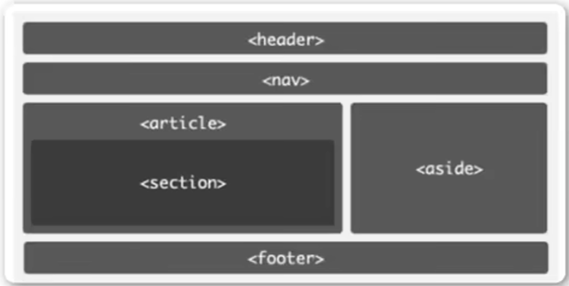
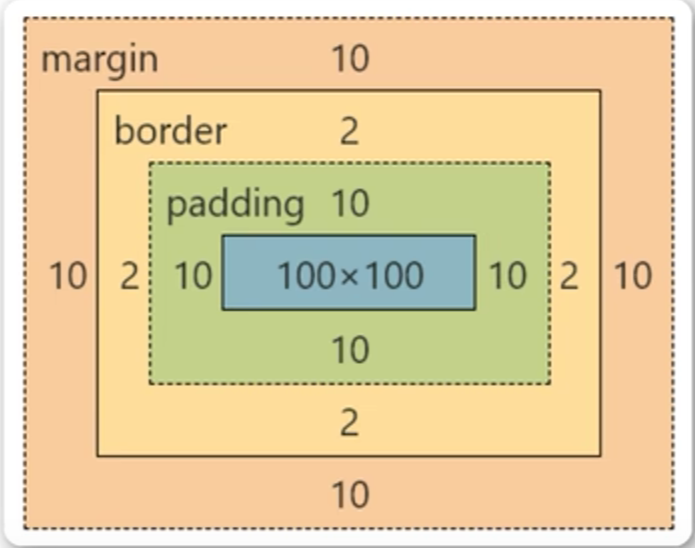

# web前端学习笔记
## html5部分
1. 适用于vscode的部分快捷键

    |          快捷键        | 作用                | 
    |:---------------------:|:------------------:|
    |       `!+Enter`     | 快速补全一个html文件      | 
    |     `Shift+Alt+F`   | 快速格式化             |
    |     `Alt+Up/Down`   | 将代码向上或向下移动一行      |
    |  `Shift+Alt+Up/Down` | 将代码向上或向下复制一行      |
    |       `Ctrl+F`      | 快速查找              |
    |       `Ctrl+H`      | 快速替换              |
    |        `h$*6`       | 创建六级标题            |
    |        `Alt+B`      | 用默认浏览器打开网页        |
    |      `ul>li*数字n`    | 创建n项的无序列表         |
    | `table>tr*m>td*n{内容}` | 生成m行n列内容都为“内容”的表格 |

2.  html5的基本骨架

        <!DOCTYPE html> // h5必备的声明
        <html> // 可以添加lang="en"表示主要语言
            <head></head> // 描述各种属性和信息，大部分不会展示给用户看
            <body></body> // 页面主体，用户可以直观看到
        </html>
    
3. SEO搜索引擎优化，有关网页在搜索引擎上的排名
   - `<title></title>`定义网页标题（显示在浏览器标题栏/状态栏上的）
   - `<meta>`描述网页文档属性，如`<meta charset="utf-8">`
   - `<h+数字1~6></h1~6>`一~六级标题（`<h1 aligh="left|center|right">一级标题</h1>`可修改标题居左居中居右方式，但不建议）
   - `

`段落（不建议直接在`<body></body>`部分写正文）
   - ` `换行
   - `
`水平线颜色，长度，粗细（单位都为像素px），对齐方式
   - `链接文本/图片</a>`超链接，默认情况下未被点击的链接文本是蓝色，鼠标点击但不松开显示红色，点击后显示紫色
   - `<em></em>`着重
   - `<b></b>`粗体
   - `<i></i>`斜体 
   - `<strong></strong>`加重
   - `<del></del>`字体的删除效果
   - ``无特定含义
   - 有序列表（会自动出现1.2.3.的编号）
   
        <ol type="1/a/A/i/I"> //type可以选择不同的编号类型：数字/大小写字母/大小写罗马字符
            <li>一个东西</li>
            <li>
                <ol>
                    <li>可以嵌套列表</li>
                </ol>
            </li>
        </ol>

   - 无序列表：将有序列表换成`<ul></ul>`默认用粗体原点标记，`type=""`也可以改变标记，`disc`默认实心圆，`circle`空心圆，`square`小方块，`none`不显示，无序列表也可以嵌套，常用作导航栏
   - 表格：`<tr></tr>`表示行，`<td></td>`表示列

        <table border="1"> //属性可加border（表格边框的粗细px，但是双线，不推荐）/width/height
            <tr>
                <td colspan="3">1、2、3</td> //colspan水平合并，rowspan垂直合并
                <td>4</td>
            </tr>
            <tr>
                <td colspan="2" rowspan="2">5、6、9、10</td> //可同时向左向上合并
                <td>7</td>
                <td>8</td>
            </tr>
            <tr>
                <td>11</td>
                <td>12</td>
            </tr>
        </table>

   - 表单，action后加服务器网址，method表示数据提交方式：get把提交的数据使url可以看到，post看不到；get提交少量数据，post提交大量数据（默认提交方式为get），name表单名称，Enter键也可以提交表单

        <form action="url" method="get/post" name="my_form">
            <input> //添加输入框
            First name:<input type="text" name="firstname">
             
            Last name:<input type="text" name="lastname">
            Password:<input type="password" name="pwd"> //输入密码字符为·或*
            <input type="submit" value="登录"> // 提交按钮，可以修改按钮上的文字
            <input type="button" value="按钮"> // button默认value为submit，但只是一个普通的按钮
            <button type="">按钮</button> // type="submit"则该按钮为提交，"button"就是一个可点击的按钮，"reset"就是重置表单数据（清空），默认为"submit"
     
        </form>

   - 块元素与行内元素（内联元素）

| 块级元素                  | 内联元素                   |
|-----------------------|------------------------|
| 块元素会在页面中独占一行          | 行内元素不会独占页面中的一行，只占自身的大小 |
| 可以设置width,height属性    | width,height属性无效       |
| 一般块级元素可以包含行内元素和其他块级元素 | 一般内联元素包含内联元素，不包含块级元素   |

常见块级元素：`div,form,h1~6,hr,p,table,ul...`

常见内联元素：`a,b,em,i,span,strong...`

行内块级元素：`button,img,input...`
   - `

`容器标签，给网页分块，使布局更清晰
    
    
    上图中`<header></header>`表示头部，`<nav></nav>`导航，`<section></section>`章节、页眉、页脚等，`<aside></aside>`侧边栏，`<footer></footer>`脚部，`<article></article>`独立完整的内容块

## css部分
1. css语法规则：

        <head>
           
        </head>

2. css的不同样式
    <ul>
    <li>内联样式（行内样式）
    
                
CSS

    
    </li>
    <li>内部样式（多个页面不适合）
    
                
    
    </li>
    <li>外部样式（在`<head>`里加入`<link>`标签）
    
                <link rel="stylesheet" type="text/css" href="./xxx.css"> //xxx.css是外部的css文件
    
    </li>
    </ul>

3. 选择器类型
    <ul>
        <li>全局选择器（一般做样式初始化）
       
                * {  // *通配符
                    margin: 0;
                    padding: 0;
                }
    </li>

    <li>元素选择器（标签选择器，一般描述元素的“共性”）：将上述代码的*替换成p,h1等标签即可</li>
    <li>类选择器（针对你想要的标签使用，类名不能以数字开头，类选择器可以被多种标签使用，同一个标签可以使用多个类）
    
            
你好

            // <h1 class="oneclass" class="twoclass">你好</h1> 是错误的，实际只会让第一个class生效
            <h2 class="oneclass twoclass">你好</h2>
            .oneclass{
                width:800px;
            }
            .twoclass{
                color:red;
            }
    
    </li>
    <li>局部“个性”**优先于**全局</li>
    <li>ID选择器：ID名称不能以数字开头，且<strong>只能使用一次</strong>，优先级最高
   
             // 写在<head>里
                  
你好
 // 在<body>中使用时

    </li>
    <li>合并选择器：不同类型的标签使用同一样式
    
        p,h3{
            height:30px;
        }

    </li>
    <li>选择器的优先级（css中权重用数字来衡量）：行内样式 > id选择器 > 类选择器 > 元素选择器
   
    |选择器类型|权重|
    |--------|---|
    |元素选择器|1|
    |class选择器|10|
    |id选择器|100|
    |内联样式|1000|
    
    如果有两个相同优先级的选择器，那么就按顺序生效，后面的会把前面的覆盖
    </li>
    </ul>

4. color的设置方式：
    <ul>
    <li>英文描述red,blue</li>
    <li>十六进制描述#0000ff（推荐）</li>
    <li>红绿蓝rgb(0,255,0)</li>
    <li>rgba（a表示透明度，0~1，1是不透明）</li>
    </ul>
5. 关于字体：Chrome浏览器可接受的最小字体是12px

    `font-weight="normal/bold/bolder/lighter/100~900"`设置文字粗细（粗/更粗/更细/400默认，900bold，Chrome浏览器上最高能显示700）

    `font-style="normal/italic"`设置斜体

    `font-family`指定字体样式`font-family:"Microsoft YaHei","Simsun","Simhei";`

6. 关于背景：
    
        

        .box{
            width: 300px;
            height: 300px;
            background-color: #ffff00; // 设置背景颜色
            background-image: url("img/img1.jpg"); // 只能以左上角为基准显示部分图片，太宽太长了又会重复填充图片
            background-repeat: repeat/repeat-x/repeat-y/no-repeat; // 默认平铺repeat/水平方向平铺/...
            background-size: 1200px (1000px)/cover/contain; // 设置背景图片的宽度、高度（也可用百分比表示）
            // （最常用）多用cover在保持图片比例的情况充满整个区域（图片可能有裁剪），contain是不裁剪图片尽量充满整个区域
            background-position: left/right/center top/center/bottom / x% y% / xpos ypos(px);
            // 默认left top(0% 0%)，center center最常用
        }

7. 文本属性：

        h1{
            text-align: left/right/center; // 调整对齐方式，默认left居左
            text-decoration: underline/overline/line-through; // 下划线，上划线，删除线
            text-transform: capitalize/uppercase/lowercase; //  每个单词开头大写/所有单词大写/所有单词小写
            text-indent: 50px; // 首行文本缩进（可以为负值，就是向前多占几格），两个字是30px
        }

8. 表格属性：

        table,td{
            border: 1px solid red; // 边框粗细 实心/空心 颜色
        } // 这样是双线框

        table{
            border-collapse: collapse; // 添加折叠边框，边框就是单线的了
            width: 500px;
            height: 300px; // 默认表格大小是根据内容字体大小决定的
        }

        td{
            text-align: left/center/right;
            vertical-align: top/center/bottom; // 垂直对齐方式
            padding: 20px (10px);
            // 内容填充与表格边框的距离，自动把表格撑开，第一个值代表上下边距，第二个代表左右，第二个不写就是默认和第一个一样
            background-color: #555555; // 单元格填充底色
            color: #ffffff; // 单元格内容文字颜色
        }

9. 关系选择器：
    - 后代选择器：`E F{}`表示E下的所有F元素（儿子孙子都算）

            ul li{
               color:green;
            } // ul内嵌套的ul或者ol的li标签也会生效
   
    - 子代选择器：`E>F {}`只对E下直接一层的F元素生效
    - 相邻兄弟选择器：`E+F {}`选择紧跟在E元素后面的第一个F元素
    - 通用兄弟选择器：`E~F {}`选择在E元素后面的所有F元素

10. CSS盒子模型（Box Model）：margin外边距（浏览器默认有8px），border边框，padding内边距（会把原来定好大小的——如div元素——给撑大，可以通过`padding-left/right/top/bottom`单独设置不同的值，margin亦可），content实际内容。
语法和table中的一样。

    

11. CSS3弹性盒子模型（flex box）

        <head>
            
        </head>
        <body>
            

                

                

                

            

12. 文档流：（标准流：块元素自上而下摆放，内联元素从左到右 **问题**：高度不同时默认底部对齐；空格折叠；元素无间隙，除非换行写）

    脱离文档流！

    - 浮动
    
            <head>
                
            </head>
            <body>
                

                

                
                 // 此时两张图片之间没有空隙
            </body>
    
        浮动还可以改变不同的容器div排列的方式（如给`ul li{float:left;}`就可以把无序列表变成水平布局，达成水平导航的效果）

        如果外部宽度不够，就会被强制挤到下一行里

        **浮动的副作用**：浮动元素会造成父元素塌陷；影响后续元素

        如何清除浮动？
    
        ①直接给父元素设置高度（**但**如果父元素内塞了一个不浮动的元素还是会受到影响）
    
        ②给受影响元素添加`clear: left/right/both;`属性清除左/右浮动
    
        ③（使用广泛）如果父元素塌陷且影响到了同级元素，不能设置父元素高度时，可以在父元素添加`overflow: hidden;(clear: both;)`属性
    
        ④上述情况还可以用伪对象方式处理。
                
                

    - 定位`position: relative/absolute/fixed`，其中绝对定位和固定定位可以脱离文档流

            div{
                width: 200px;
                height: 200px;
                background-color: red;
                position: relative;
                left: 200px; // 相对定位
                right/top/bottom: 200px; // 控制距离上下左右
            }
    
            .box1{
                width: 200px;
                height: 200px;
                background-color: red;
                position: absolute; // 绝对定位
                left: 200px; // 同样同上下左右来标定位置
            }
            .box2{
                width: 200px;
                height: 200px;
                background-color: green;
            }
            .box3{
                width: 200px;
                height: 200px;
                background-color: blue;
                position: absolute;
                left: 200px;
            } // 每设置一个绝对定位就增加一个图层，会互相压盖，而浮动只有两层
    
            .box1{
                width: 200px;
                height: 200px;
                background-color: red;
                position: fixed; // 固定定位
                left: 200px; // 同样同上下左右来标定位置
            } // 一般一个页面也就用一处，作用是不管页面如何滚动始终固定在哪个位置

    设置定位后，相对定位和绝对定位都是相对于具有定位的父级元素进行调整，如果父级元素不存在定位，就逐级向上寻找直到顶层文档。

13. `z-index`属性的数值可以调整谁覆盖谁，值大的盖住小的。
14. `border-radius`属性（单位px）可以设置圆角效果，要变成圆形就写成100%。

    一个值：四个角
    
    两个值：第一个值表示左上&右下，第二个值左下&右上；
    
    三个值：左上 左下&右上 右下
    
    四个值：左上 右上 右下 左下

15. `box-shadow:h-shadow v-shadow blur color;`添加阴影：水平、垂直阴影的位置（必选）px，负数表示向左上投影，模糊距离px，阴影颜色
16. 在`<style>`中用`@keyframes`创建动画

            @keyframes name{ // 给动画命名name
                from/0%{
                    css样式
                }
                percent{
                    css样式
                } // 可以添加多个percent
                to/100%{
                    css样式
                }
            }

    用`animation`执行动画：

            div{
                animation:name duration timing-function delay iteration-count direction animation-play-state;
            }
            div:hover{
                background-color: coral; // 鼠标悬停在上面会显示成橘色
                animation-play-state: paused;
            }

    |属性| 值                                                                     |
    |-----------------------------------------------------------------------|----|
    |name动画名称| /                                                                     |
    |duration| 3s                                                                    |
    |执行动画的时间| ease（逐渐变慢，默认）/linear（匀速）/ease-in（加速）/ease-out（减速）/ease-in-out（先加速后减速） |
    |delay延迟| 5s(ms)                                                                |
    |iteration| 数字（不写就是默认一次）                                                          |
    |direction| normal（默认向前播放）/alternate（偶数次向前播放，奇数次反方向播放）                            |
    |动画的播放状态| running（播放）/paused                                                    |

17. `opacity`透明度属性0~1
18. 媒体查询：能在不同的终端设备下展示不同的效果

    `<meta name="viewport" content="width=device-width,initial-scale=1.0">`标签使用设备的宽度作为视图宽度并**禁止初始的缩放**

            @media screen and (max-width: 768px) {
                .box{
                    background-color:blue;
                }
            } // 手机
            @media screen and (min-width: 768px) and (max-width: 996px) {
                .box{
                    background-color: green;
                }
            } // 平板
            @media screen and (min-width:996px) {
                .box{
                    background-color: red;
                }
            } // 电脑

19. CSS-Sprite雪碧图，精灵图：零星图片->包含到大图中，用位置提取；减少了图片的字节，减少了网页的http请求，提高了网页性能。
    
            
            
            .icon1{
                display: block; // block让一个行内元素变成块级元素，inline就是行内元素
                width: 45px;
                height: 70px;
                background-image: url(1.png)
                background-position: -10px 0; 
            }

20. 字体图标：加载速度快，减少http请求，兼容性高。在[阿里字体图标库](https://iconfont.cn/)下载代码，下载的文件中demo.html里推荐用font-class方式

## JavaScript部分
1. 标识符是识别各种变量名的名称（如变量名），可用字母$_和数字（不能开头）组成（中文是合法的标识符，但不建议使用），不能是一些保留关键字。
2. js引擎的运行方式：先解析代码，获得所有被声明的变量，然后再一行行运行。所以所有变量的声明语句（只创建了一个名字）都会被提到最前面，也就是“变量提升”。
3. 引入js的方式：（都是在`<body>`中加入）
    - 嵌入html文件：``标签写js
    - 引入本地独立js文件：``
    - 引入网页来源js文件：最常见的是[jquery的库](http://code.jquery.com)``检查时在network处刷新，选择All查看是否有js资源
4. 单行注释：`//` 多行注释：`/* */`（`Alt+Shift+A`多行注释快捷键） 嵌入html文件的注释：`<!-- xxxxx -->`
5. 输出方式：

            alert("内容"); // 会弹出对话框
            document.write("内容"); // 输出到页面（换行用document.write(" ");
            console.log("内容"); // 打印到控制室（使用最频繁），可在网页的“检查”时打印出

6. 六种数据类型，ES6新增了第七种Symbol类型和第八种BigInt类型。

    原始类型（基础类型）：数值（数字）、字符串、布尔值；

    合成类型（复合类型）：对象；

            var user={
                age:19,
                name:"me",
                marriage:false,
            }

    undefined和null是特殊类型，null一般代表对象为空，undefined一般代表数值为“没有”。

7. `typeof varient`运算符判断数据类型（返回“对象”的话不太准确，因为null/{}/数组等也可以返回object）
8. `===`表示严格比较（数值和类型）如`10=="10"->true,10==="10"->false`，`!=,!==`同理；非布尔值也可以取反成为布尔值（NaN约等于0）。
9. 字符串和数字相加会得到一个字符串（数字作为字符串添加到原字符串末尾），字符串单双引号可以相互交替嵌套，转义规则相同；字符串默认写在一行内，换行要加转义符\；`str.length`
10. 字符串方法
    - `str.charAt(n)`可以返回字符串第n个位置的字符（从0开始），如果n越界就返回空字符串
    - `s1.concat(s2,s3)`返回s1和s2，s3（参数数量不限）合并的字符串，原字符串不变；会将数据型变量转换为字符串型，但原变量类型不变；直接用`s3=s1+s2`也可以实现。但`concat`不会做运算，`+`会从左到右先做运算再变成字符串
    - `s1.substring(n1,n2)`表示截取下标n1~n2（不包含第n2个位置）的部分，若省略参数n2就是从第n1个位置到结尾，若参数为负数就自动转换成0，若n2<n1那就自动转换顺序；
    - `substr`括号内的第一个参数是起始位置，第二个参数是提取的字符串长度，若省略第二个参数就默认到结尾，若只有一个参数且为负数，那么就从原字符串末尾开始数（如`var s1="helloworld";s1.substr(-5)就是"world"`），若第二个参数为负数，那就自动转换成0，返回空字符串；
    - `s1.indexOf(s2,n)`返回s1中（从第n个位置开始，可省略）第一次出现完整s2（不能断断续续）的位置，未匹配成功则返回-1，一般用这个方法来判断是否存在某字符串
    - `s1.trim()`用于去掉字符串两端的空格、换行符、回车符、制表符等，返回新字符串，不改变原字符串；ES6的新方法`trimEnd()/trimStart()`可以单独去掉字符串尾部、头部空格
11. 数组方法
    - `"a|b|c".split("|",n)`返回`['a','b','c']`，若括号中为空字符串，则返回每个单个字符的数组，若没有参数则返回原字符串；n为限定返回的成员数（默认取前几个）
    - 数组外加中括号，可以放任意类型混合，先定义再赋值或先赋值都可以，数组嵌套数组也可以（多维数组），`length`属性可以返回数组长度，数组越界返回`undefined`，数组的遍历可以用for/while/for(var i in a)
    - `typeof`碰到数组返回object，`Array.isArray(arr)`可以判定是否是数组，返回布尔值
    - `arr.push(obj1,obj2)`可以向原数组添加多个元素，并返回现在数组的长度；`pop()`删除数组最后的一个元素并返回该元素；`shift()`删除数组第一个元素并返回该元素，空数组则返回`undefined`，可以用来遍历并清空整个数组；`unshift()`在头部添加元素并返回数组长度
    - `['a','b','c'].join("|")`返回a|b|c，碰到undefined或者null则转换成空字符串
    - `s1.concat(s2)`可以合并数组s2到s1，返回新数组，原数组不变，也有和`push`一样的用法和作用，主要应用于：上拉加载，合并数据
    - `reverse()`方法可以颠倒数组的排序，返回改变后的数组**（会改变原数组）**，可用于翻转字符串（先把字符串split成数组再reverse再join）
    - `indexOf`用法同字符串
12. 函数的声明

            function add(x,y){
                console.log(x+y);
                return x+y;
            }

    函数名和变量名一样，也有提升——可以先调用再创建
13. 对象里的数据成员如果是函数，那就称它为“方法”，属性的值也可以是其他对象，可以链式调用

            var user={
                name:"Josephine",
                friends:["Oliva","Sarah"],
                getName:function(){
                    return name;
                },
                jobs:{
                    type:"scientist",
                    salary:100,
                },
            };

14. Math对象
    - `Math.abs(n)`
    - `/Math.min(n1,n2)/Math.max(n1,n2,n3)`min()max()括号中没有参数则为-Infinity和Infinity
    - `Math.floor(n)/Math.ceil(n)`向上下取整`random()`返回0到1之间的一个随机数
    - 生成任意范围内的随机数

            function getRandomArbitrary(min,max){
                return Math.random()*(max-min)+min;
            }

15. Date对象：以1970年1月1日零点作为时间的零点，可以表示前后各一亿天，时间单位为毫秒(Unix是20世纪70年代出现的一个操作系统，它认为这是时间纪元，js遵循此约束)
    - `Date.now()`
    - `new Date(年，月，日，时，分，秒，毫秒)`可以创建一个Date对象，括号里只写数字n就是写n对应的时间，括号里没有参数就是获取当前时间
    - | 方法        | 作用             |
      |----------------|---|
      | getTime() | 返回距零点的毫秒数      |
      | getDate() | 返回每个月的几号（从1开始） |
      | getDay()  | 返回星期几（0表示星期日）  |
      | getYear()  | 返回距离1900年的年数   |
      |getFullYear()| 返回具体四位数的年份     |
      |getMonth()| 返回月份（0~11）     |
      |getHours()| 返回小时（0~23）     |
      |getMilliseconds()| 返回毫秒（0~999）    |
      |getMinutes()| 返回分钟（0~59）     |
      |getSeconds()| 返回秒（0~5）       |
16. DOM(Document Object Model)是js操作网页的接口（只是一种接口规范，可以用任何语言实现），DOM的最小组成单位是节点，节点通过树形结构构成DOM树。
    - 七种节点类型：

        >Document：整个文档树的顶层节点
    
        >DocumentType：doctype标签

        >Element：网页的各种HTML标签

        >Attribute：网页元素的属性（如class="right")

        >Text：标签之间或标签所含的文本

        >Comment：注释

        >DocumentFragment：文档的片段

    - 浏览器原生提供document节点，可在``中打印`console.log(document)`
    - 有上级下级同级关系
    - `Node.nodeType`属性对应表

        | 节点类型           | 对应值                                |对应常量|
        |------------------------------------|----|-----|
        | 文档节点(document) | 9           |Node.DOCUMENT_NODE|
        | 元素节点(element)| 1           |Node.ELEMENT_NODE|
        |属性节点(attr)| 2         |Node.ATTRIBUTE_NODE|
        |文本节点(text)| 3               |Node.TEXT_NODE|
        |文档片段节点(DocumentFragment)| 11 |Node.DOCUMENT_FRAGMENT_NODE|

17. document对象：
    - `var divs = document.getElementsByTagName('div');`以数组形式返回在document中找到的所有div标签
    - `document.getElementsByClassName('container')`
    - `document.getElementsByName('myname')`选择具有特定`name`属性的（如表单），返回一个NodeList，但使用率很低
    - `document.getElementById('myID')`只返回一个元素（因为id不能重复）
    - `document.querySelector('.class')`筛选出特定的css选择器，返回找到的第一个
    - `document.querySelectorAll('.class')筛选多个特定的css选择器
    - `var text = document.createElement("p")`可以创建p标签等
    - `var content = document.createTextNode("内容“)`创建文本内容
    - `text.appendChild(content)`可以将内容塞到标签里
    - `var id = document.createAttribute("id")`创建属性
    - `id.value = "root";`给属性赋值
    - `text.setAttributeNode(id)`把属性赋给标签
    - 先获取标签，然后用`appendChild`把新建的标签塞进去
18. Element对象、属性：
    - 
19. 