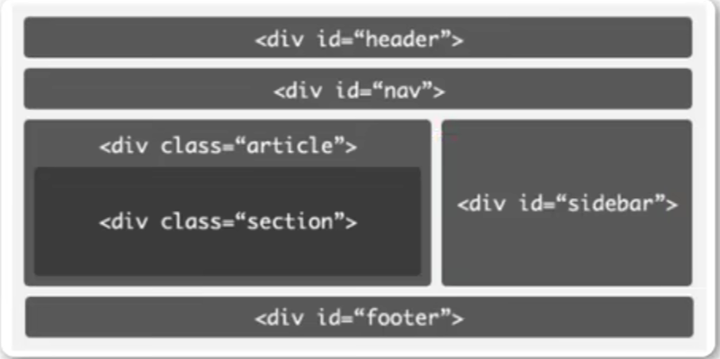
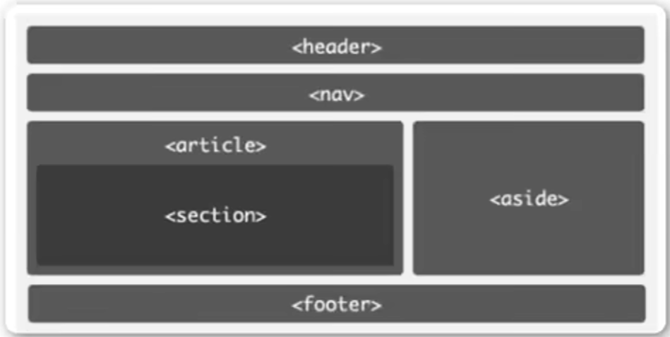

# web前端学习笔记
## html5部分
1. 适用于vscode的部分快捷键

    |          快捷键        | 作用                | 
    |:---------------------:|:------------------:|
    |       `!+Enter`     | 快速补全一个html文件      | 
    |     `Shift+Alt+F`   | 快速格式化             |
    |     `Alt+Up/Down`   | 将代码向上或向下移动一行      |
    |  `Shift+Alt+Up/Down` | 将代码向上或向下复制一行      |
    |       `Ctrl+F`      | 快速查找              |
    |       `Ctrl+H`      | 快速替换              |
    |        `h$*6`       | 创建六级标题            |
    |        `Alt+B`      | 用默认浏览器打开网页        |
    |      `ul>li*数字n`    | 创建n项的无序列表         |
    | `table>tr*m>td*n{内容}` | 生成m行n列内容都为“内容”的表格 |

2.  html5的基本骨架

        <!DOCTYPE html> // h5必备的声明
        <html> // 可以添加lang="en"表示主要语言
            <head></head> // 描述各种属性和信息，大部分不会展示给用户看
            <body></body> // 页面主体，用户可以直观看到
        </html>
    
3. SEO搜索引擎优化，有关网页在搜索引擎上的排名
   - `<title></title>`定义网页标题（显示在浏览器标题栏/状态栏上的）
   - `<meta>`描述网页文档属性，如`<meta charset="utf-8">`
   - `<h+数字1~6></h1~6>`一~六级标题（`<h1 aligh="left|center|right">一级标题</h1>`可修改标题居左居中居右方式，但不建议）
   - `

`段落（不建议直接在`<body></body>`部分写正文）
   - ` `换行
   - `
`水平线颜色，长度，粗细（单位都为像素px），对齐方式
   - `链接文本/图片</a>`超链接，默认情况下未被点击的链接文本是蓝色，鼠标点击但不松开显示红色，点击后显示紫色
   - `<em></em>`着重
   - `<b></b>`粗体
   - `<i></i>`斜体 
   - `<strong></strong>`加重
   - `<del></del>`字体的删除效果
   - ``无特定含义
   - 有序列表（会自动出现1.2.3.的编号）
   
        <ol type="1|a|A|i|I"> //type可以选择不同的编号类型：数字/大小写字母/大小写罗马字符
            <li>一个东西</li>
            <li>
                <ol>
                    <li>可以嵌套列表</li>
                </ol>
            </li>
        </ol>

   - 无序列表：将有序列表换成`<ul></ul>`默认用粗体原点标记，`type=""`也可以改变标记，`disc`默认实心圆，`circle`空心圆，`square`小方块，`none`不显示，无序列表也可以嵌套，常用作导航栏
   - 表格：`<tr></tr>`表示行，`<td></td>`表示列

        <table border="1"> //属性可加border（表格边框的粗细px，但是双线，不推荐）/width/height
            <tr>
                <td colspan="3">1、2、3</td> //colspan水平合并，rowspan垂直合并
                <td>4</td>
            </tr>
            <tr>
                <td colspan="2" rowspan="2">5、6、9、10</td> //可同时向左向上合并
                <td>7</td>
                <td>8</td>
            </tr>
            <tr>
                <td>11</td>
                <td>12</td>
            </tr>
        </table>

   - 表单，action后加服务器网址，method表示数据提交方式：get把提交的数据使url可以看到，post看不到；get提交少量数据，post提交大量数据，name表单名称

        <form action="url" method="get|post" name="myform">
            <input> //添加输入框
            First name:<input type="text" name="firstname">
             
            Last name:<input type="text" name="lastname">
            Password:<input type="password" name="pwd"> //输入密码字符为·或*
            <input type="submit" value="登录"> //提交按钮，可以修改按钮上的文字
            <input type="button">
        </form>

   - 块元素与行内元素（内联元素）

| 块级元素                  | 内联元素                   |
|-----------------------|------------------------|
| 块元素会在页面中独占一行          | 行内元素不会独占页面中的一行，只占自身的大小 |
| 可以设置width,height属性    | width,height属性无效       |
| 一般块级元素可以包含行内元素和其他块级元素 | 一般内联元素包含内联元素，不包含块级元素   |

常见块级元素：`div,form,h1~6,hr,p,table,ul...`

常见内联元素：`a,b,em,i,span,strong...`

行内块级元素：`button,img,input...`
   - `

`容器标签，给网页分块，使布局更清晰

上图中`<header></header>`表示头部，`<nav></nav>`导航，`<section></section>`章节、页眉、页脚等，`<aside></aside>`侧边栏，`<footer></footer>`脚部，`<article></article>`独立完整的内容块

## css部分
1. css语法规则：

        <head>
           
        </head>

2. css的不同样式
    <ul>
    <li>内联样式（行内样式）
    
                
CSS

    
    </li>
    <li>内部样式（多个页面不适合）
    
                
    
    </li>
    <li>外部样式（在`<head>`里加入`<link>`标签）
    
                <link rel="stylesheet" type="text/css" href="./xxx.css"> //xxx.css是外部的css文件
    
    </li>
</ul>
   
3. 选择器类型
    <ul>
        <li>全局选择器（一般做样式初始化）
       
                * {  // *通配符
                    margin: 0;
                    padding: 0;
                }
    </li>

    <li>元素选择器（标签选择器，一般描述元素的“共性”）</li>
    <li>类选择器（针对你想要的标签使用，类名不能以数字开头，类选择器可以被多种标签使用，同一个标签可以使用多个类）
    
            
你好

            // <h1 class="oneclass" class="twoclass">你好</h1> 是错误的，实际只会让第一个class生效
            <h2 class="oneclass twoclass">你好</h2>
            .oneclass{
                width:800px;
            }
            .twoclass{
                color:red;
            }
    
    </li>
    <li>局部“个性”**优先于**全局</li>
    </ul>
      
4. 