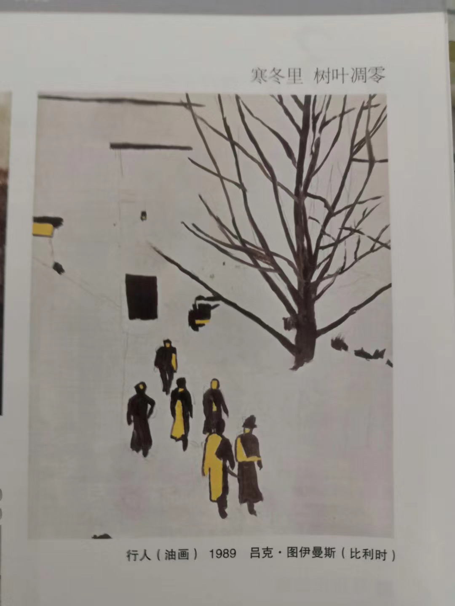

# 围巾小人斯卡夫

2018年的冬天，在美术课上，我坐在教室后门的角落里和同桌肆无忌惮地聊着周末的趣事。
偶然低头一瞥，就这样和吕克·图伊曼斯的《行人》猝不及防地相遇了，他的围巾好像是摄人心魄的钩子，只看一眼就让我感受到了上天注定的吸引力。
下课前老师会把美术书收上去，所以我要在那之前记住行人的样子。
我不由自主地开始在英语书的扉页上描摹，后来我在此基础上又创造出了围巾小人，我叫他“斯卡夫”（我想这个名字应该很容易猜到为什么），
每到上课发呆的时候都会在课本上画画，每本书上都或多或少留下了图伊曼斯式的“行人”和斯卡夫的足迹。
我借围巾小人斯卡夫讲述了那些孤独的故事或是连文字都难以启齿的故事，他虽然简单但记录了生活中我感悟出的道理，也承载了我心底很多说不出口的话。
 期末美术考试的时候，老师说《灰色的树》是重点，我却满脑子都是它前面的那幅《行人》。
 两年后经历了一段很特殊的时期，闲来无事我又想起那幅画，但我已经快忘了他的名字。